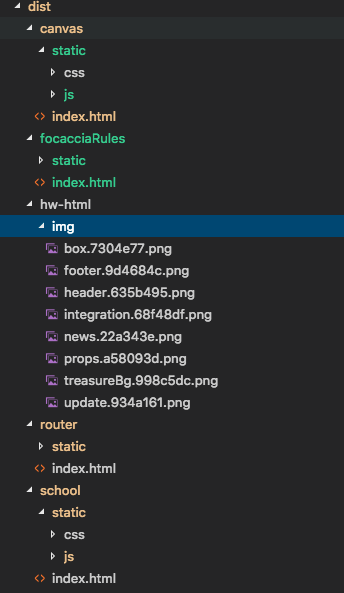

# Eat-vue

##### 一个Vue脚手架
# 目录结构
```
.
├── README.md  
├── build                          「构建脚本」
│   ├── build.js
│   ├── check-versions.js
│   ├── dev-client.js
│   ├── dev-server.js
│   ├── utils.js
│   ├── vue-loader.conf.js
│   ├── webpack.base.conf.js
│   ├── webpack.dev.conf.js
│   ├── webpack.entry.conf.js
│   └── webpack.prod.conf.js
├── config                         「环境配置目录」
│   ├── dev.env.js
│   ├── index.js
│   └── prod.env.js
├── dist
├── index.html
├── package.json
├── src                            「源码目录」
│   ├── App.vue
│   ├── assets
│   │   └── logo.png
│   ├── components
│   │   └── HelloWorld.vue
│   ├── main.js
│   └── pages
│       ├── school
│       └── video
└── static                         「通用静态资源」
```

# Git分支管理 
## 分支说明

```
|分支 | push|delete |说明
|master   |否|否| 主分支 用于产品发布
|develop |否|否| 主要用于合并子分支，非开发分支
```
> 上面的这几个分支都是受保护分支，也就是说普通开发者是无权删除远程分支。

> push： 表示在当前分支下，普通开发者是否可以push

> delete： 表示普通开发者是否可以删除当前分支

> 尽量使用子分支开发，根据功能&&人员定义分支，自测与解决冲突后提交develop分支

> develop测试通过,后汇入master分支上线

# 安装

``` bash
# 安装package.json 列出的所有依赖库
npm install

# 启动开发环境
npm run dev

# 生产环境打包
npm run build

# 为生产环境查看和包分析器报告
npm run build --report
```

# 开发

### css编译
- less
### 使用ui
- mintUi

#部署

在开发过程中是组件化开发方式，打包后会根据功能膜块生成对应的文件目录
